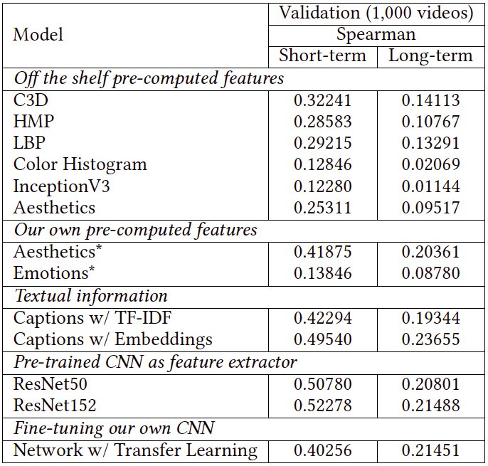
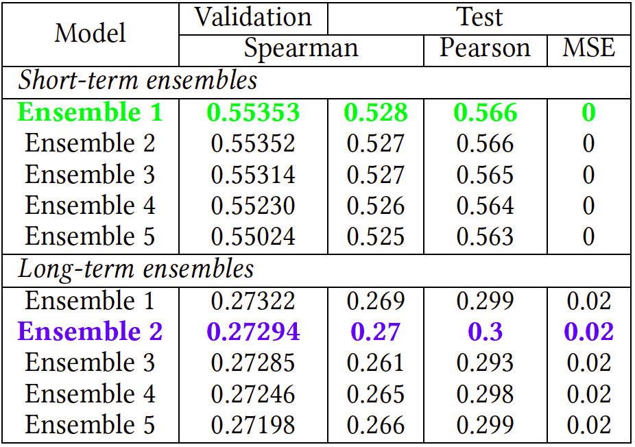
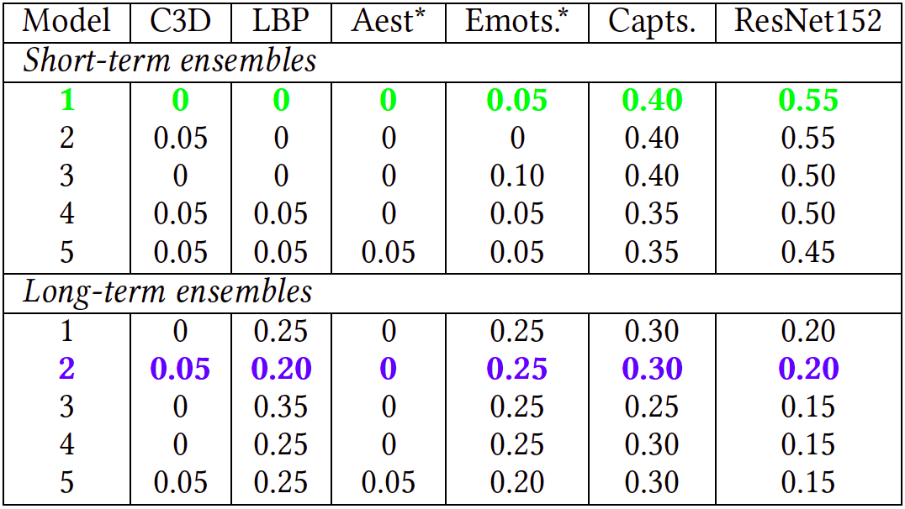
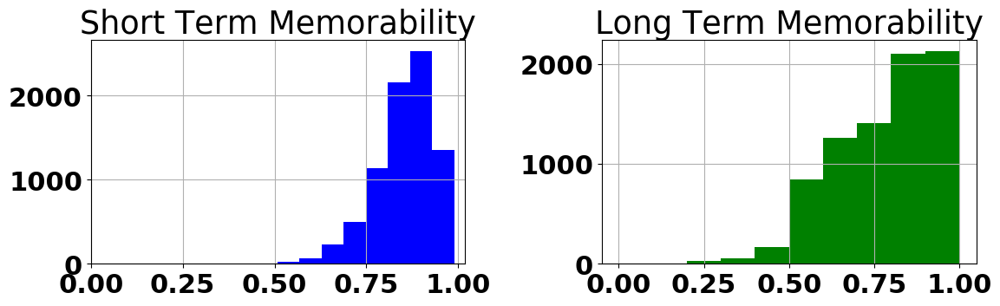
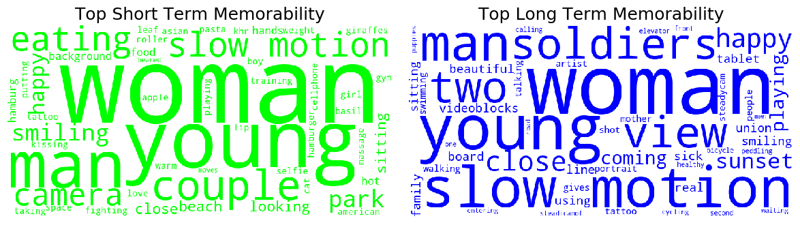
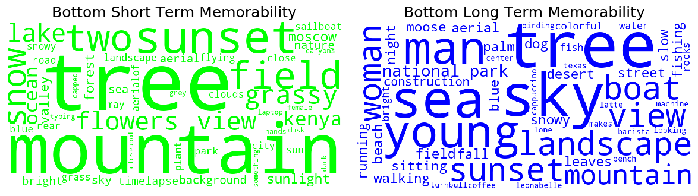

# Insight@DCU in the Memorability Challenge at MediaEval2019

[Slides at MediaEval2019](https://docs.google.com/presentation/d/12ar0BFb27I9OsFZM2y9oqLLeSPi0TljWqEuMVIeepkU/) that include: 
* Our approaches & the features we computed (e.g. emotions)
* Our results on our validation set and on the official test set
* Visualization techniques such as Class Activation Maps for CNNs
* [Table with Results](https://docs.google.com/spreadsheets/d/1LrenTHNGRZzCHYluYl2YPdmlHuUsTJSMhUIb1X91hdk/edit?usp=drive_web&ouid=100420670696373997922)
* Ensembles: [short-term table](https://docs.google.com/spreadsheets/d/1ToQoHWf3xvJRG-Imi-mtY7gym1p47M4g4htAkxSxFcU/edit#gid=287676692) & [long-term table](https://docs.google.com/spreadsheets/d/1CxyFeBVttJCmscKNHsOLun7bsxIuxhbrUwYSUoF-DVU/edit#gid=286590362)

## Challenge

The Memorability challenge is [here](http://www.multimediaeval.org/mediaeval2019/memorability/).

Problem: Predicting how memorable a video is to viewers i.e. the probability a video will be remembered. 

## Dataset

10,000 soundless short videos extracted from raw footage used by professionals when creating content, and in particular, commercials. Each video has two scores for memorability: short-term and long-term (that refer to its probability to be remembered after two different durations of memory retention).

10,000 videos: 8,000 development & 2,000 official test

## Our approach

**Development: 7,000 our training & 1,000 our validation**

**Extract 8 frames per video (first + one per second)**

Individual models per set of features & then combine them using ensemble models using:
* Traditional Machine Learning:
  - Support Vector Regression
  - Bayesian Ridge Regression
* Deep Learning (highly regularized):
  - Embeddings for words (captions)
  - Transfer Learning w/ Neural Network activations as features 
  - Transfer Learning by fine-tuning our own networks

### Our models:

* Off the shelf pre-computed features: C3D, HMP, LBP, InceptionV3, Color Histogram & Aesthetic
* Our own pre-computed features: Our Aesthetics & Emotions
* Textual information: bag-of-words TF-IDF with linear models & Glove's Embeddings + RNN GRU + high dropout
* Pre-trained CNNs as feature extractors: transfer learning with ImageNet: VGG16, DenseNet121, ResNet50 & ResNet152
* Fine-tuning our own CNN: ResNet - head + FC + sigmoid
* Ensemble models: combinations of individual models’ predictions

### Why emotions?

MediaEval 2018: Duy-Tue Tran-Van et al @ HCMUS’s paper: "Predicting Media Memorability Using Deep Features and Recurrent Network"

**Long-term scores: 0.727 (left), 0.273 (right)**


### Our pre-computed Emotion features:

7 emotions: anger, disgust, fear, happiness, sadness, surprise, neutral; gender scores & spatial information


## Technologies used in our work

* [Python 3](https://www.python.org/)
* [numpy](http://www.numpy.org)
* [pandas](https://pandas.pydata.org/)
* [matplotlib](https://matplotlib.org/)
* [scikit-learn](https://scikit-learn.org/)
* [pillow](https://pillow.readthedocs.io/)
* [keras](https://keras.io)
* [tensorflow](https://www.tensorflow.org/)
* [jupyter](https://jupyter.org/)
* [Docker](https://www.docker.com/)
* [HDF5](https://www.h5py.org/)

## Our Deployment

1. Download the dataset (you may want to use an external drive) via FTP like [here](https://stackoverflow.com/questions/113886/how-to-recursively-download-a-folder-via-ftp-on-linux):
```
$ wget -m --ftp-user="<user>" --ftp-password=<password> ftp://<ftp server>
```
and unzip multi-part files like [here](http://koenaerts.ca/unzip-multi-part-archives-in-linux/):
```
$ zip --fix me18me-devset.zip --figures/activation_maps mybigzipfile.zip
$ unzip mybigzipfile.zip
```

2. Mount the dataset as drive in */datasets* in *docker-compose.yml*. As an example:
```
volumes:
  - /Volumes/HDD/datasets/:/datasets
```

3. Build the docker image:
```
$ cd docker
$ make build
```

4. Create a docker container based on the image:
```
$ make run
```

5. SSH to the docker container:
```
$ make dev
```

6. Extract frames from videos:
```
$ python src/extract_frames.py
```

6. Extract emotion features from frames:
```
$ python src/extract_emotions.py
```

7. Modify the file *src/config.py* to run the desired experiment.

8. Run the training:
```
$ python src/train.py
```

9. Run the test:
```
$ python src/test.py
```

10. Run submission generation:
```
$ python src/submit.py
```

11. [Optional] Visualizing heatmaps of class activation:
```
$ python src/viz_activations.py --model ResNet152
```

## Our Results

1. **Validation Results on our Individual Models:**


2. **Ensemble Results for the 5 runs each**


3. **Ensemble Features for the 5 runs each**


## Visualization

1. **Short-term and long-term Memorability Histograms**


2. **Exploring Top Captions**


3. **Exploring Bottom Captions**


## Findings & Contributions

* **DL CNN models** will typically outperform models trained with **captions** and other visual features for short-term memorability; however, techniques such as **embeddings** and RNNs can achieve very high results for captions

* We believe **fine-tuned CNN models** will outperform pre-trained models as feature extractors given enough training samples (**not proven** in this paper)

* **Ensembling models by using predictions** instead of training models with very long vectors of features is an alternative we used to counteract **memory limitations**

* **Ensembling models with different modalities** such as emotions with captions, high-level representations from CNNs and visual pre-computed features achieve the best results as they **represent different high-level abstractions**

## Extra: Activation Maps for CNNs

Model ResNet152 trained with ImageNet was leveraged for the video-frame 48 of the top short-term and long-term most memorable videos. This is very useful for understanding which parts of these given images led the pre-trained CNN to the ImageNet classification. This technique is called *class activation map* (CAM) visualization and consists of producing heatmaps of class activation over input images. For further details see Francois Chollet's Deep Learning with Python book.

### Top short-term most memorable videos

1. **video798.webm**

The top-4 classes predicted for this video frame are as follows: 
* 'torch': 0.23151287 (with 23.25% probability)
* 'hatchet': 0.094463184 (with 9.44% probability)
* 'crutch': 0.0654099 (with 6.54% probability)
* 'pedestal': 0.06340647 (with 6.34% probability)


2. **video1981.webm**

* 'bow_tie': 0.99436283
* 'torch': 0.0010983162
* 'theater_curtain': 0.00067173946
* 'feather_boa': 0.0004574099
* 'theater_curtain': 0.00067173946
* 'groom': 0.00034087678


3. **video4903.webm**

* 'television': 0.5428618
* 'desktop_computer': 0.115691125
* 'screen': 0.11060062
* 'laptop': 0.06419162
* 'monitor': 0.05998577
* 'notebook': 0.040473375


4. **video9496.webm**

* 'sandbar': 0.55648345
* 'seashore': 0.13317421
* 'lakeside': 0.03515112
* 'wreck': 0.028257731
* 'volcano': 0.017195351


5. **video6103.webm**

* 'fur_coat': 0.66497004
* 'cloak': 0.16292651
* 'ski_mask': 0.024773473
* 'lab_coat': 0.016840363


### Top long-term most memorable videos

1. **video5186.webm**

* 'mountain_bike': 0.8176742
* 'bicycle-built-for-two': 0.1651485
* 'unicycle': 0.009558631
* 'alp': 0.0027272117


2. **video4798.webm**

* 'jean': 0.64808583
* 'cash_machine': 0.06661992
* 'trench_coat': 0.026500706
* 'wardrobe': 0.026173087
* 'prison': 0.025266951


3. **video480.webm**

* 'giant_schnauzer': 0.28221375
* 'cocker_spaniel': 0.172711
* 'Scotch_terrier': 0.11454323
* 'Great_Dane': 0.045542818
* 'Lakeland_terrier': 0.033769395
* 'standard_schnauzer': 0.030899713


4. **video7606.webm**

* 'chain_saw': 0.15715672
* 'pole': 0.099422
* 'hook': 0.064023055
* 'paintbrush': 0.04958201
* 'shovel': 0.031757597


5. **video4809.webm**

* 'racket': 0.9964013
* 'tennis_ball': 0.0032226138
* 'ping-pong_ball': 0.00037128705


## Learning Resources

### MediaEval 2018

* MediaEval 2018: http://multimediaeval.org/mediaeval2018/memorability/index.html
* Presentation at MediaEval 2018 - Predicting Media Memorability: https://www.slideshare.net/multimediaeval/mediaeval-2018-predicting-media-memorability
* Proceedings of the MediaEval 2018 Workshop: http://ceur-ws.org/Vol-2283/

### Regression: predicting a continous variable

* Keras & Regression: https://www.pyimagesearch.com/2019/01/21/regression-with-keras/
* Keras custom metrics: https://machinelearningmastery.com/custom-metrics-deep-learning-keras-python/

### Embeddings for processing video captions

* Stanford's GloVe: https://nlp.stanford.edu/projects/glove/
* Pre-trained word embeddings: https://github.com/keras-team/keras/blob/master/examples/pretrained_word_embeddings.py
* https://blog.keras.io/using-pre-trained-word-embeddings-in-a-keras-model.html
* https://towardsdatascience.com/machine-learning-word-embedding-sentiment-classification-using-keras-b83c28087456

### Custom generators and data augmentation

* https://medium.com/the-artificial-impostor/custom-image-augmentation-with-keras-70595b01aeac
* https://www.pyimagesearch.com/2018/12/24/how-to-use-keras-fit-and-fit_generator-a-hands-on-tutorial/
* https://keras.io/utils/#sequence
* https://medium.com/datadriveninvestor/keras-training-on-large-datasets-3e9d9dbc09d4

### Training the final model

* How to Train a Final Machine Learning Model: https://machinelearningmastery.com/train-final-machine-learning-model/