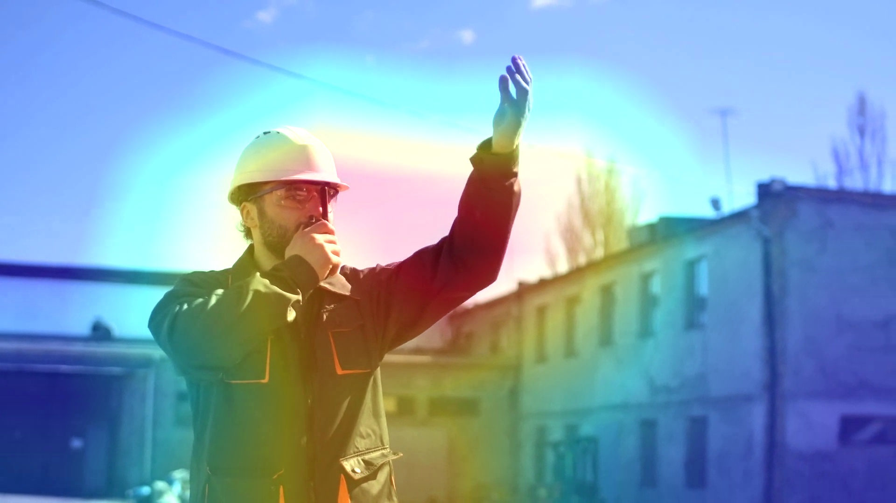

# Insight@DCU in the Memorability Challenge at MediaEval2019

This task focuses on the problem of predicting how memorable a video is to viewers. It requires participants to automatically predict memorability scores for videos that reflect the probability a video will be remembered. 

Task participants are provided with an extensive dataset of videos that are accompanied by memorability annotations, as well as pre-extracted state-of-the-art visual features. The ground truth has been collected through recognition tests, and thus results from objective measurement of memory performance. Participants will be required to train computational models capable of inferring video memorability from visual content. Optionally, descriptive titles attached to the videos may be used. Models will be evaluated through standard evaluation metrics used in ranking tasks (Spearman’s rank correlation). The data set used in 2019, is the same as in 2018 (2018’s testset ground truth data has not been released). This year the task focuses on understanding the patterns in the data and improving the ability of algorithms to capture those patterns.

## Challenge

http://www.multimediaeval.org/mediaeval2019/memorability/

## Dataset

The dataset is composed of 10,000 (soundless) short videos extracted from raw footage used by professionals when creating content, and in particular, commercials. Each video consists of a coherent unit in terms of meaning and is associated with two scores of memorability that refer to its probability to be remembered after two different durations of memory retention. 

These videos come with a set of pre-extracted features, such as: Dense SIFT, HoG descriptors, LBP, GIST, Color Histogram, MFCC, Fc7 layer from AlexNet, C3D features, etc.

## Technologies used in our work

* [Python 3](https://www.python.org/)
* [numpy](http://www.numpy.org)
* [pandas](https://pandas.pydata.org/)
* [matplotlib](https://matplotlib.org/)
* [scikit-learn](https://scikit-learn.org/)
* [pillow](https://pillow.readthedocs.io/)
* [keras](https://keras.io)
* [tensorflow](https://www.tensorflow.org/)
* [jupyter](https://jupyter.org/)
* [Docker](https://www.docker.com/)
* [HDF5](https://www.h5py.org/)

## Our Results

See the following [table](https://docs.google.com/spreadsheets/d/1LrenTHNGRZzCHYluYl2YPdmlHuUsTJSMhUIb1X91hdk/)

## Our Deployment

1. Download the dataset (you may want to use an external drive) via FTP like [here](https://stackoverflow.com/questions/113886/how-to-recursively-download-a-folder-via-ftp-on-linux):
```
$ wget -m --ftp-user="<user>" --ftp-password=<password> ftp://<ftp server>
```
and unzip multi-part files like [here](http://koenaerts.ca/unzip-multi-part-archives-in-linux/):
```
$ zip --fix me18me-devset.zip --figures/activation_maps mybigzipfile.zip
$ unzip mybigzipfile.zip
```

2. Mount the dataset as drive in */datasets* in *docker-compose.yml*. As an example:
```
volumes:
  - /Volumes/HDD/datasets/:/datasets
```

3. Build the docker image:
```
$ cd docker
$ make build
```

4. Create a docker container based on the image:
```
$ make run
```

5. SSH to the docker container:
```
$ make dev
```

6. Extract frames from videos:
```
$ python src/extract_frames.py
```

6. Extract emotion features from frames:
```
$ python src/extract_emotions.py
```

7. Modify the file *src/config.py* to run the desired experiment:

8. Run the training:
```
$ python src/train.py
```

9. [Optional] Visualizing heatmaps of class activation:
```
$ python src/viz_activations.py --model ResNet152
```

## Visualization: Activation Maps

Model ResNet152 trained with ImageNet was leveraged for the video-frame 48 of the top short-term and long-term most memorable videos. This is very useful for understanding which parts of these given images led the pre-trained CNN to the ImageNet classification. This technique is called *class activation map* (CAM) visualization and consists of producing heatmaps of class activation over input images. For further details see Francois Chollet's Deep Learning with Python book.

### Top short-term most memorable videos

1. **video798.webm**

The top-4 classes predicted for this video frame are as follows: 
* 'torch': 0.23151287 (with 23.25% probability)
* 'hatchet': 0.094463184 (with 9.44% probability)
* 'crutch': 0.0654099 (with 6.54% probability)
* 'pedestal': 0.06340647 (with 6.34% probability)


2. **video1981.webm**

* 'bow_tie': 0.99436283
* 'torch': 0.0010983162
* 'theater_curtain': 0.00067173946
* 'feather_boa': 0.0004574099
* 'theater_curtain': 0.00067173946
* 'groom': 0.00034087678


3. **video4903.webm**

* 'television': 0.5428618
* 'desktop_computer': 0.115691125
* 'screen': 0.11060062
* 'laptop': 0.06419162
* 'monitor': 0.05998577
* 'notebook': 0.040473375


4. **video9496.webm**

* 'sandbar': 0.55648345
* 'seashore': 0.13317421
* 'lakeside': 0.03515112
* 'wreck': 0.028257731
* 'volcano': 0.017195351


5. **video6103.webm**

* 'fur_coat': 0.66497004
* 'cloak': 0.16292651
* 'ski_mask': 0.024773473
* 'lab_coat': 0.016840363


### Top long-term most memorable videos

1. **video5186.webm**

* 'mountain_bike': 0.8176742
* 'bicycle-built-for-two': 0.1651485
* 'unicycle': 0.009558631
* 'alp': 0.0027272117


2. **video4798.webm**

* 'jean': 0.64808583
* 'cash_machine': 0.06661992
* 'trench_coat': 0.026500706
* 'wardrobe': 0.026173087
* 'prison': 0.025266951


3. **video480.webm**

* 'giant_schnauzer': 0.28221375
* 'cocker_spaniel': 0.172711
* 'Scotch_terrier': 0.11454323
* 'Great_Dane': 0.045542818
* 'Lakeland_terrier': 0.033769395
* 'standard_schnauzer': 0.030899713


4. **video7606.webm**

* 'chain_saw': 0.15715672
* 'pole': 0.099422
* 'hook': 0.064023055
* 'paintbrush': 0.04958201
* 'shovel': 0.031757597



5. **video4809.webm**

* 'racket': 0.9964013
* 'tennis_ball': 0.0032226138
* 'ping-pong_ball': 0.00037128705


## Learning Resources

### MediaEval 2018

* MediaEval 2018: http://multimediaeval.org/mediaeval2018/memorability/index.html
* Presentation at MediaEval 2018 - Predicting Media Memorability: https://www.slideshare.net/multimediaeval/mediaeval-2018-predicting-media-memorability
* Proceedings of the MediaEval 2018 Workshop: http://ceur-ws.org/Vol-2283/

### Regression: predicting a continous variable

* Keras & Regression: https://www.pyimagesearch.com/2019/01/21/regression-with-keras/
* Keras custom metrics: https://machinelearningmastery.com/custom-metrics-deep-learning-keras-python/

### Embeddings for processing video captions

* Stanford's GloVe: https://nlp.stanford.edu/projects/glove/
* Pre-trained word embeddings: https://github.com/keras-team/keras/blob/master/examples/pretrained_word_embeddings.py
* https://blog.keras.io/using-pre-trained-word-embeddings-in-a-keras-model.html
* https://towardsdatascience.com/machine-learning-word-embedding-sentiment-classification-using-keras-b83c28087456

### Custom generators and data augmentation

* https://medium.com/the-artificial-impostor/custom-image-augmentation-with-keras-70595b01aeac
* https://www.pyimagesearch.com/2018/12/24/how-to-use-keras-fit-and-fit_generator-a-hands-on-tutorial/
* https://keras.io/utils/#sequence
* https://medium.com/datadriveninvestor/keras-training-on-large-datasets-3e9d9dbc09d4

### Training the final model

* How to Train a Final Machine Learning Model: https://machinelearningmastery.com/train-final-machine-learning-model/